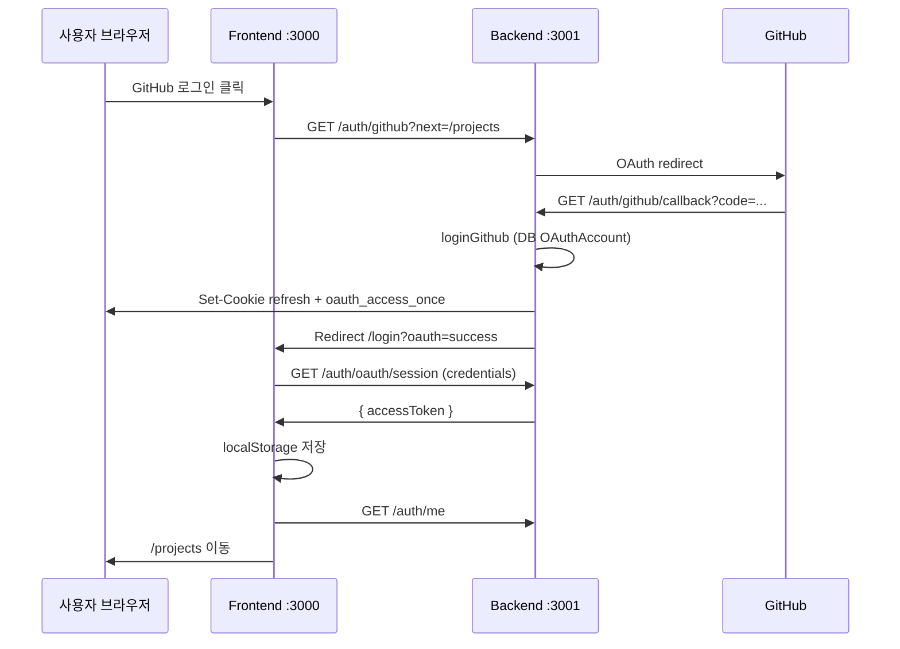
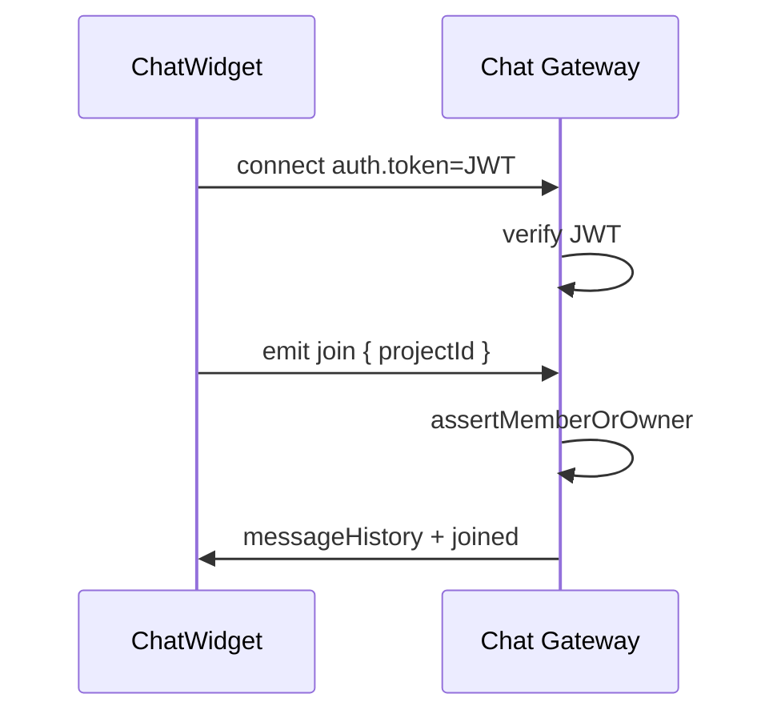

# Sync-up 리팩터링 및 수정 이력

> 작성 기준: 2026-05-31  
> 범위: 에러 처리·로깅 강화, 보안(인증/데이터 보호), 도메인 복잡도 분리, 프론트 연동, GitHub OAuth 장애 대응

---

## 목차

1. [개요](#1-개요)
2. [아키텍처 변경 요약](#2-아키텍처-변경-요약)
3. [공통 인프라 (`backend/src/common`)](#3-공통-인프라-backendsrccommon)
4. [도메인 계층 (`backend/src/domain`)](#4-도메인-계층-backendsrcdomain)
5. [인증·보안 (`backend/src/auth`)](#5-인증보안-backendsrcauth)
6. [채팅 (`backend/src/chat`)](#6-채팅-backendsrcchat)
7. [프로젝트·칸반 API 보안](#7-프로젝트칸반-api-보안)
8. [프론트엔드 변경](#8-프론트엔드-변경)
9. [환경 변수 (`.env`)](#9-환경-변수-env)
10. [GitHub 로그인 장애 (실제 원인)](#10-github-로그인-장애-실제-원인)
11. [실행·마이그레이션](#11-실행마이그레이션)
12. [추가/수정 파일 목록](#12-추가수정-파일-목록)
13. [알려진 제한·추후 작업](#13-알려진-제한추후-작업)

---

## 1. 개요

### 1.1 작업 배경

다음 세 가지를 한 번에 개선하는 작업이 진행되었습니다.

| 목표 | 내용 |
|------|------|
| **에러 처리 및 로깅** | 전역 예외 필터, 구조화 JSON 로그, 요청 추적 ID |
| **보안 강화** | API 인증 누락 제거, JWT·쿠키·OAuth·채팅 소켓 보안, rate limit |
| **도메인 분리** | 프로젝트 접근 규칙·채팅·비밀번호 정책을 인프라(Prisma/HTTP)와 분리 |

### 1.2 GitHub 로그인 관련 (별도 이슈)

버튼 클릭 시 「잠시 후 다시 시도」가 뜬 원인은 **`.env`의 GitHub Client 설정 오류가 아니라**, DB에 `OAuthAccount` 테이블이 없어 콜백 처리 중 Prisma가 실패한 것이었습니다.  
→ `npx prisma migrate deploy` 적용 후 해결.

---

## 2. 아키텍처 변경 요약

### 2.1 계층 구조 (목표)

```
HTTP / WebSocket (Controller, Gateway)
        ↓
Application (AuthService, CalendarEventsService, …)
        ↓
Domain (ProjectAccessService, password.policy, chat types/mapper)
        ↓
Infrastructure (ChatRepository, PrismaService, AuthTokenService)
```

### 2.2 `AppModule` 변경

- `CommonModule` — 전역 예외 필터, 로깅 인터셉터
- `ProjectDomainModule` — `ProjectAccessService` 글로벌 export
- 미들웨어: `RequestIdMiddleware`, `SecurityHeadersMiddleware` (전체 라우트)

### 2.3 `main.ts` 변경

- `validateEnv()` — Zod 기반 환경 변수 검증 (기동 시)
- `ValidationPipe` — `whitelist`, `forbidNonWhitelisted`, `transform`
- `trust proxy` — 리버스 프록시 뒤 IP·rate limit 정확도
- `AppLogger` — Nest 기본 로거 대체

---

## 3. 공통 인프라 (`backend/src/common`)

### 3.1 예외 처리

| 파일 | 역할 |
|------|------|
| `exceptions/error-codes.ts` | `VALIDATION_FAILED`, `UNAUTHORIZED`, `RATE_LIMITED` 등 안정적 코드 |
| `exceptions/app.exception.ts` | `AppException`, `validationException()` |
| `filters/all-exceptions.filter.ts` | 전역 catch → JSON 응답 형식 통일 |

**HTTP 오류 응답 형식 (예시)**

```json
{
  "success": false,
  "code": "UNAUTHORIZED",
  "message": "로그인이 필요합니다.",
  "requestId": "uuid-..."
}
```

- 운영(`NODE_ENV=production`)에서는 `details`·스택 노출 최소화
- Prisma `P2002`(중복), `P2025`(없음) 일부 매핑

### 3.2 로깅

| 파일 | 역할 |
|------|------|
| `logger/app-logger.service.ts` | JSON 한 줄 로그 (`ts`, `level`, `context`, `message`, 메타) |
| `interceptors/logging.interceptor.ts` | HTTP 요청 완료/실패 시 `durationMs`, `status` 기록 |

### 3.3 보안 미들웨어

| 파일 | 헤더/동작 |
|------|-----------|
| `middleware/security-headers.middleware.ts` | `X-Content-Type-Options`, `X-Frame-Options`, `Referrer-Policy`, prod 시 HSTS |
| `middleware/request-id.middleware.ts` | `X-Request-Id` 생성·전달 |

### 3.4 Rate limiting

| 파일 | 설명 |
|------|------|
| `guards/throttle.guard.ts` | 인메모리 슬라이딩 윈도 (단일 인스턴스용) |
| `auth/guards/auth-throttle.guard.ts` | 로그인·회원가입·refresh — 분당 20회 |

> 멀티 replica 운영 시 Redis 등 외부 store로 교체 권장.

### 3.5 환경 변수 검증

`config/env.schema.ts`

- 필수: `DATABASE_URL`, `JWT_ACCESS_SECRET`, `JWT_REFRESH_SECRET` (각 16자 이상)
- `COOKIE_SAMESITE=none` 이면 `COOKIE_SECURE=true` 강제
- production 에서 `FRONTEND_URL` 필수
- 선택: `GITHUB_*`, `CHAT_TRANSLATION_*`, `OPENAI_API_KEY`

---

## 4. 도메인 계층 (`backend/src/domain`)

### 4.1 프로젝트 접근 (`project/project-access.service.ts`)

- `assertMemberOrOwner(projectId, userId)` — 오너 또는 `ProjectMember`만 허용
- `isMemberOrOwner()` — 채팅 게이트웨이 등 boolean 체크용
- 로그인 없음 → **401** `UNAUTHORIZED` (이전 403에서 정리)

**사용처**

- 캘린더 이벤트 (`CalendarEventsService`)
- 채팅 게이트웨이 join 시
- (칸반은 서비스 레벨에서 동일 규칙 적용)

### 4.2 인증 정책 (`auth/password.policy.ts`)

- 비밀번호 최소 **8자**, 최대 128자
- 이메일·닉네임 형식 검증
- `normalizeEmail`, `normalizeNickname`

### 4.3 채팅 도메인 (`chat/`)

- `chat.types.ts` — `ChatMessageDto`, `parseChatSourceLang()`
- `chat-message.mapper.ts` — DB row → DTO 변환

상세 가이드: `backend/src/domain/README.md`

---

## 5. 인증·보안 (`backend/src/auth`)

### 5.1 토큰 서비스 분리 (`application/auth-token.service.ts`)

| 기능 | 설명 |
|------|------|
| `issueTokensForUserId` | access + refresh 발급, refresh는 DB에 bcrypt hash 저장 |
| `rotateAccessToken` | **Refresh token rotation** — 기존 세션 삭제 후 새 쌍 발급 |
| `revokeRefreshSession` | 로그아웃 시 세션 삭제 |

- bcrypt cost **12**
- `POST /auth/refresh` 성공 시 **새 refresh 쿠키**도 갱신

### 5.2 OAuth 보안 개선

**이전 (취약)**  
GitHub 콜백 후 access token을 URL query (`?accessToken=...`)로 프론트에 전달.

**이후**

1. 콜백에서 `oauth_access_once` **HttpOnly 쿠키** 설정 (60초, path `/auth/oauth`)
2. 프론트가 `GET /auth/oauth/session` + `credentials: include` 로 1회 수령
3. 쿠키 즉시 삭제

관련 API:

| 메서드 | 경로 | 설명 |
|--------|------|------|
| GET | `/auth/github` | GitHub OAuth 시작 (`oauth_next` 쿠키) |
| GET | `/auth/github/callback` | GitHub → 로그인 처리 → `/login?oauth=success` |
| GET | `/auth/oauth/session` | access token 1회 수령 |

### 5.3 로컬 회원가입/로그인

- `AuthService`가 `AuthTokenService`·`password.policy` 사용
- 회원가입 bcrypt **12** rounds

### 5.4 GitHub Guard

- `oauth_next` — `//` 로 시작하는 open redirect 차단 (`!startsWith('//')`)

---

## 6. 채팅 (`backend/src/chat`)

### 6.1 WebSocket JWT 인증

**이전**  
클라이언트가 `join` 시 `userId`를 body로내면 서버가 그대로 신뢰.

**이후**

1. 연결 시 `handshake.auth.token` 에 access JWT **필수**
2. `ChatAuthService.verifyAccessToken()` — `jwt.verifyAsync`
3. `join` 은 `{ projectId }` 만 — `userId`는 JWT `sub` 사용

프론트 (`ChatWidget.tsx`):

```ts
io(`${getApiBaseUrl()}/chat`, {
  auth: { token: getAccessToken() },
  withCredentials: true,
});
```

### 6.2 Repository 분리 (`chat.repository.ts`)

| 메서드 | 개선 |
|--------|------|
| `ensureProjectRoom` | `findUnique` + `create` → **`upsert`** (race 방지) |
| `createMessage` | 메시지 + `ChatMessageI18n` → **`$transaction`** |
| `loadLatestMessages` / `loadOlderMessages` | Prisma 조회 + mapper |

### 6.3 Gateway 정리 (`chat.gateway.ts`)

- `ProjectAccessService`, `ChatRepository`, `AppLogger` 사용
- **재입장 시** `leaveCurrentRoom()` — 이전 프로젝트 room·접속자 수 정리
- 메시지 길이 상한 4000자

---

## 7. 프로젝트·칸반 API 보안

### 7.1 프로젝트 (`project.controller.ts`)

| 엔드포인트 | 변경 |
|------------|------|
| `POST /projects` | `JwtAuthGuard` 추가, **ownerId = JWT 사용자** (body `ownerId` 무시) |
| `POST /projects/confirm` | 동일 + artifact 작성자 검증 |
| `GET /projects/:id/kanban` | 인증 + 멤버 검증 |

DTO:

- `CreateProjectDto.ownerId` — optional, deprecated
- `ConfirmProjectDto.ownerId` — 제거

### 7.2 칸반 (`kanban.controller.ts`)

- 컨트롤러 전체에 `@UseGuards(JwtAuthGuard)`
- 모든 메서드에 `userId` 전달 → `KanbanService`에서 `ProjectAccessService` 검증

### 7.3 PrismaService 중복 제거

다음 모듈에서 **중복 `PrismaService` provider 제거** (글로벌 `PrismaModule`만 사용):

- `project.module.ts`
- `kanban.module.ts`
- `notice.module.ts`
- `community.module.ts`

---

## 8. 프론트엔드 변경

### 8.1 API 클라이언트 (`lib/api.ts`)

- 모든 `fetch`에 **`credentials: "include"`** — refresh·OAuth 쿠키 전송
- `auth: true` 인데 토큰 없으면 즉시 오류
- 오류 파싱 → `lib/api-error.ts` (`ApiError`, `code`, `requestId`)

### 8.2 GitHub OAuth (`lib/auth/oauth.ts`)

- `consumeOAuthSession()` — `/auth/oauth/session` 호출 후 localStorage 저장
- URL에 access token **노출 안 함**

### 8.3 로그인 페이지 (`app/login/page.tsx`)

- `oauth=success` → `consumeOAuthSession()` → `fetchCurrentUser()`
- GitHub 시작 URL → `getApiBaseUrl()` 단일화

### 8.4 Header 로그아웃

- `clearAccessToken()` 전에 `POST /auth/logout` + `credentials: include`
- 서버 refresh 세션 폐기

### 8.5 ChatWidget

| 항목 | 내용 |
|------|------|
| 소켓 인증 | `auth: { token }` |
| 프로젝트 전환 | `effectiveProjectId` 변경 시 소켓 끊고 재-join |
| 토큰 만료 | `connect_error` 시 `refreshAccessToken` 후 재연결 시도 |
| unread 배지 | 초기값 `0` |
| 로그인 유도 | 토큰 없을 때 명확한 메시지 |

### 8.6 칸반 API (`lib/kanbanApi.ts`)

- 모든 요청 `auth: true` + `credentials: include`

### 8.7 Next.js API 프록시

| 파일 | 변경 |
|------|------|
| `app/api/projects/route.ts` | POST 시 `Authorization` 헤더 전달 |
| `app/api/projects/confirm/route.ts` | 동일 |

### 8.8 프로젝트 생성·확정

- `CreateProjectClient.tsx` — body에서 `ownerId` 제거, Authorization 헤더
- `drafts/[artifactId]/page.tsx` — confirm 시 Authorization, `ownerId` 제거

### 8.9 기타

- `lib/api-base-url.ts` — API URL 공통
- `lib/api/client.ts` — deprecated, `getAccessToken` 사용 안내

---

## 9. 환경 변수 (`.env`)

### 9.1 필수·권장 항목

```env
# DB
DATABASE_URL=postgresql://postgres:postgres@db:5432/syncup

# JWT (각 16자 이상)
JWT_ACCESS_SECRET=...
JWT_REFRESH_SECRET=...
JWT_ACCESS_EXPIRES_IN=15m
JWT_REFRESH_EXPIRES_IN=30d

# 프론트·CORS·OAuth 리다이렉트
FRONTEND_URL=http://localhost:3000
NEXT_PUBLIC_API_URL=http://localhost:3001
INTERNAL_BACKEND_URL=http://backend:3000

# 쿠키 (로컬 개발)
COOKIE_SECURE=false
COOKIE_SAMESITE=lax

# GitHub OAuth
GITHUB_CLIENT_ID=...
GITHUB_CLIENT_SECRET=...
GITHUB_CALLBACK_URL=http://localhost:3001/auth/github/callback
```

### 9.2 Docker 포트 매핑과 Callback URL

| 서비스 | 호스트 | 컨테이너 | 비고 |
|--------|--------|----------|------|
| Frontend | 3000 | 3000 | 브라우저 접속 |
| Backend | **3001** | 3000 | API·OAuth callback |
| PostgreSQL | 127.0.0.1:5432 | 5432 | |

→ GitHub OAuth App의 **Authorization callback URL** 은 반드시:

`http://localhost:3001/auth/github/callback`

### 9.3 `.env.example` 반영 항목

- `JWT_*`, `FRONTEND_URL`, `COOKIE_*`, `LOG_LEVEL`
- 채팅 번역 관련 주석

---

## 10. GitHub 로그인 장애 (실제 원인)

### 10.1 증상

- 로그인 페이지에서 GitHub 버튼 클릭
- GitHub 인증 후 돌아오면 「GitHub 로그인에 실패했습니다. 잠시 후 다시 시도해 주세요」

### 10.2 로그 분석

```
GitHub OAuth callback failed
The table `public.OAuthAccount` does not exist in the current database.
```

- GitHub ↔ 앱 OAuth **교환은 성공** (`/auth/github/callback?code=...` 302)
- `AuthService.loginGithub()` → `prisma.oAuthAccount.findUnique()` 에서 실패
- 컨트롤러 catch → `oauth=failed` 로 프론트 리다이렉트

### 10.3 해결

```bash
docker compose exec backend npx prisma migrate deploy
```

적용된 마이그레이션 중 관련:

- `20260218213058_add_oauth_and_refresh` — `OAuthAccount`, `RefreshSession` 등

추가로 `.env`에 `FRONTEND_URL=http://localhost:3000` 설정 및 백엔드 재시작.

---

## 11. 실행·마이그레이션

### 11.1 개발 환경 기동

```bash
cd /home/huijun/sync
cp .env.example .env   # 최초 1회
# .env 값 편집 (JWT, GITHUB, OPENAI 등)

docker compose build
docker compose up -d
```

### 11.2 DB 마이그레이션 (필수)

```bash
docker compose exec backend npx prisma migrate deploy
```

DB 볼륨을 지운 경우(`docker compose down -v`) **매번** 다시 실행.

### 11.3 시드 (선택)

```bash
docker compose exec backend npx prisma db seed
```

테스트 계정 예: `dev1@example.com` / `password123`

### 11.4 서브모듈 최신화

```bash
git pull --recurse-submodules
git submodule update --init --recursive
```

### 11.5 접속 URL

| 용도 | URL |
|------|-----|
| 프론트 | http://localhost:3000 |
| API | http://localhost:3001 |
| Swagger (SWAGGER=true) | http://localhost:3001/swagger |

---

## 12. 추가/수정 파일 목록

### 12.1 백엔드 — 신규

```
backend/src/common/
  common.module.ts
  config/env.schema.ts
  exceptions/error-codes.ts
  exceptions/app.exception.ts
  filters/all-exceptions.filter.ts
  interceptors/logging.interceptor.ts
  logger/app-logger.service.ts
  middleware/request-id.middleware.ts
  middleware/security-headers.middleware.ts
  guards/throttle.guard.ts

backend/src/domain/
  README.md
  auth/password.policy.ts
  project/project-access.service.ts
  project/project-domain.module.ts
  chat/chat.types.ts
  chat/chat-message.mapper.ts

backend/src/auth/
  application/auth-token.service.ts
  guards/auth-throttle.guard.ts

backend/src/chat/
  chat.repository.ts
  chat-auth.service.ts
```

### 12.2 백엔드 — 주요 수정

```
backend/src/main.ts
backend/src/app.module.ts
backend/src/auth/auth.service.ts
backend/src/auth/auth.controller.ts
backend/src/auth/auth.module.ts
backend/src/auth/guards/github-auth.guard.ts
backend/src/auth/strategies/jwt-access.strategy.ts
backend/src/chat/chat.gateway.ts
backend/src/chat/chat.module.ts
backend/src/chat/chat-translation.service.ts
backend/src/project/project.controller.ts
backend/src/project/project.service.ts
backend/src/project/project.module.ts
backend/src/project/calendar-events.service.ts
backend/src/project/dto/create-project.dto.ts
backend/src/project/dto/confirm-project.dto.ts
backend/src/project/dto/create-calendar-event.dto.ts
backend/src/kanban/kanban.controller.ts
backend/src/kanban/kanban.service.ts
backend/src/kanban/kanban.module.ts
backend/src/notice/notice.module.ts
backend/src/community/community.module.ts
```

### 12.3 프론트엔드 — 신규·수정

```
frontend/src/lib/api-error.ts
frontend/src/lib/api-base-url.ts
frontend/src/lib/auth/oauth.ts
frontend/src/lib/api/client.ts          (deprecated 래퍼)

frontend/src/lib/api.ts
frontend/src/lib/auth.ts
frontend/src/lib/kanbanApi.ts
frontend/src/app/login/page.tsx
frontend/src/app/components/Header.tsx
frontend/src/app/components/ChatWidget.tsx
frontend/src/app/projects/new/CreateProjectClient.tsx
frontend/src/app/drafts/[artifactId]/page.tsx
frontend/src/app/api/projects/route.ts
frontend/src/app/api/projects/confirm/route.ts
```

### 12.4 루트

```
.env.example
docs/CHANGELOG_REFACTORING.md   (본 문서)
```

---

## 13. 알려진 제한·추후 작업

| 항목 | 설명 |
|------|------|
| Rate limit | 인메모리 — 멀티 인스턴스 시 Redis 권장 |
| WebSocket 예외 | HTTP `AllExceptionsFilter`와 별도 — 소켓 전용 핸들링 확장 가능 |
| 공지·커뮤니티 API | 일부 공개 조회 유지 — 필요 시 동일 Guard 패턴 적용 |
| GitHub email 자동 연결 | 동일 email 기존 계정 자동 merge — 보안 검토 여지 |
| `ai` 모듈 | `any` 타입 다수 — 동작과 무관, 점진적 타입 강화 |
| 운영 Swagger | `SWAGGER=true` 시 인증 없이 노출 — prod 비활성 권장 |
| 서브모듈 커밋 | `backend`/`frontend` 변경이 로컬에만 있을 수 있음 — 팀 공유 시 각 repo 커밋·푸시 필요 |

---

## 부록: OAuth 성공 시퀀스 (현재)



---

## 부록: 채팅 연결 시퀀스 (현재)



---

*문서 끝.*
